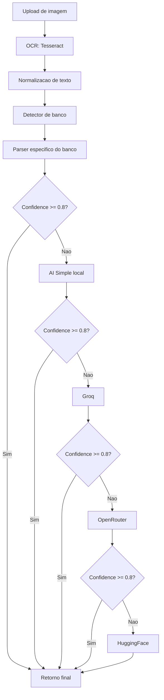

# Exemplos de Uso do Módulo OCR

## Arquitetura OCR e Fallbacks



**Regras de fallback:**
- Sempre tenta parser especifico primeiro.
- Se a confianca ficar abaixo do threshold, tenta IA local.
- Se ainda estiver baixa, tenta Groq, depois OpenRouter e HuggingFace.
- Se todos falharem, retorna o melhor resultado disponivel (SimpleAI) com banco marcado como fallback.

**Campos retornados:**
- `banco` (string)
- `valor` (number)
- `data` (string YYYY-MM-DD)
- `pagador` (string)
- `recebedor` (string)
- `txId` (string)
- `rawText` (string)
- `confidence` (number 0-1)

## Processamento Básico

```typescript
import { processImage } from '@/lib/ocr';
import { orchestrateParse } from '@/lib/parser';

// Processar imagem
const imageBuffer = fs.readFileSync('comprovante.jpg');
const ocrResult = await processImage(imageBuffer);

console.log('Texto extraído:', ocrResult.text);
console.log('Confiança OCR:', ocrResult.confidence);

// Extrair dados
const parsedData = await orchestrateParse(ocrResult.text);

console.log('Banco:', parsedData.banco);
console.log('Valor:', parsedData.valor);
console.log('Data:', parsedData.data);
console.log('Pagador:', parsedData.pagador);
console.log('Recebedor:', parsedData.recebedor);
console.log('Confidence:', parsedData.confidence);
```

## Usando Parser Específico de Banco

```typescript
import { nubankParser } from '@/lib/parser/banks';

const text = 'Comprovante Nubank...';
const result = nubankParser.parse(text);

console.log(result);
// {
//   banco: 'NUBANK',
//   valor: 150.50,
//   data: '2024-01-15',
//   pagador: 'João Silva',
//   recebedor: 'Maria Silva',
//   txId: 'ABC123...',
//   rawText: '...',
//   confidence: 0.95
// }
```

## Usando Apenas Heurísticas Locais (Sem API)

```typescript
import { extractWithLocalAIOnly } from '@/lib/ai';

const text = 'Comprovante de transferência...';
const result = extractWithLocalAIOnly(text);

// Não faz chamadas de API externa
// Usa apenas regex e heurísticas locais
```

## Forçando Uso de IA Externa

```typescript
import { extractWithExternalAIOnly } from '@/lib/ai';

const text = 'Comprovante...';
try {
  const result = await extractWithExternalAIOnly(text);
  // Tenta Groq -> OpenRouter -> HuggingFace
} catch (error) {
  // Todas as IAs falharam
}
```

## Usando Provider Específico

```typescript
import { extractWithSpecificProvider } from '@/lib/ai';

const text = 'Comprovante...';
const result = await extractWithSpecificProvider(text, 'groq');
// Ou: 'openrouter', 'huggingface'
```

## Detectando Banco

```typescript
import { detectBank, detectBankWithConfidence } from '@/lib/parser';

const text = 'Comprovante Nubank...';

// Simples
const bank = detectBank(text);
console.log(bank); // 'nubank'

// Com confiança
const result = detectBankWithConfidence(text);
console.log(result);
// {
//   bank: 'nubank',
//   confidence: 0.85,
//   matchedKeywords: ['nubank', 'nubank pagamentos']
// }
```

## Calculando Confidence Score

```typescript
import { calculateConfidence, isConfidenceAcceptable } from '@/lib/parser';
import { ParsedPix } from '@/types/pix';

const parsed: ParsedPix = {
  banco: 'NUBANK',
  valor: 150.50,
  data: '2024-01-15',
  pagador: 'João Silva',
  recebedor: 'Maria Silva',
  txId: 'ABC123...',
  rawText: '...',
  confidence: 0,
};

const confidence = calculateConfidence(parsed);
console.log(confidence); // 1.0 (100%)

if (isConfidenceAcceptable(confidence)) {
  console.log('Dados confiáveis!');
}
```

## Adicionando Novo Banco

```typescript
// lib/parser/banks/sicredi.ts
import { ParsedPix, BankParser } from '@/types/pix';
import { calculateConfidence } from '../confidenceService';

export const sicrediParser: BankParser = {
  bankName: 'SICREDI',

  detect(text: string): boolean {
    const keywords = ['sicredi', 'credito', 'cooperativa'];
    return keywords.some(k => text.toLowerCase().includes(k));
  },

  parse(text: string): ParsedPix {
    // Implementar extração específica
    const result: ParsedPix = {
      banco: this.bankName,
      // ... extrair campos
      rawText: text.substring(0, 1000),
      confidence: 0,
    };
    
    result.confidence = calculateConfidence(result);
    return result;
  },
};

// lib/parser/banks/index.ts
import { sicrediParser } from './sicredi';

export const bankParsers: BankParser[] = [
  // ... outros parsers
  sicrediParser, // <-- Adicionar aqui
];
```

## Opções de Parsing

```typescript
import { orchestrateParse } from '@/lib/parser';

// Forçar uso de IA (ignora parser específico)
const result = await orchestrateParse(text, { forceAI: true });

// Usar apenas heurísticas locais (sem APIs externas)
const result = await orchestrateParse(text, { localOnly: true });

// Forçar banco específico
const result = await orchestrateParse(text, { specificBank: 'nubank' });
```

## Normalizando Texto

```typescript
import { normalizeText, extractLines } from '@/lib/ocr';

const rawText = `  R$  150,00
  Data:  15/01/2024
  Nubank   `;

const normalized = normalizeText(rawText);
console.log(normalized);
// "R$ 150,00
// Data: 15/01/2024
// Nubank"

const lines = extractLines(normalized);
console.log(lines);
// ["R$ 150,00", "Data: 15/01/2024", "Nubank"]
```

## Processamento em Lote

```typescript
import { processMultipleImages } from '@/lib/ocr';

const buffers = [
  fs.readFileSync('comp1.jpg'),
  fs.readFileSync('comp2.jpg'),
  fs.readFileSync('comp3.jpg'),
];

const results = await processMultipleImages(buffers);

for (const result of results) {
  console.log('Texto:', result.text);
  console.log('Confiança:', result.confidence);
}
```

## Tratamento de Erros

```typescript
import { OCRError } from '@/types/pix';

try {
  const ocrResult = await processImage(buffer);
} catch (error) {
  if (error instanceof OCRError) {
    console.log('Código:', error.code);
    console.log('Mensagem:', error.message);
    console.log('Status:', error.statusCode);
  } else {
    console.log('Erro inesperado:', error);
  }
}
```

## Verificando Providers Disponíveis

```typescript
import { getAvailableProviders } from '@/lib/ai';

const providers = getAvailableProviders();
console.log(providers);
// ['simple', 'groq', 'openrouter'] (depende das env vars)
```
